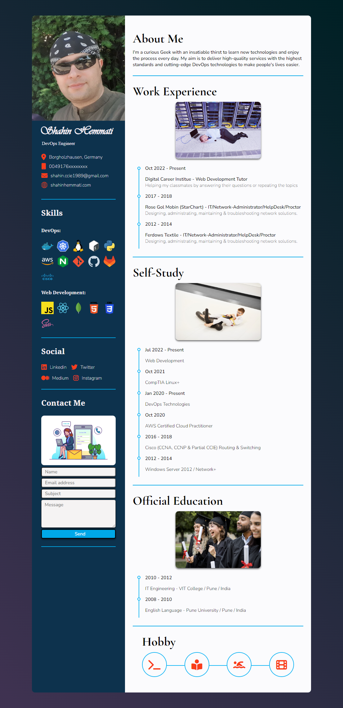

# DCI User Interface Basics Final Project

[Live Version](http://shahin.thefabwebdev.com/)

Full Screenshot:

First thing first!

- Don’t open my resume website with Firefox. because it works best on chrome only!

What are the used resources:

Layout:

- Has been done with Grid

Fonts:

- Google fonts
- Adobe fonts
- Local fonts
- [fontjoy.com](https://fontjoy.com/) has been used for the font pairing.
    - Vivaldi font (caligraphy) → used for my full name
    - Garamond → used for h2s
    - Droid-serif → used for h3s
    - Nunito → used for paragraphs

Icons:

- Font Awesome
- For the SVGs in the Skills, Social & contact me, I have used custom SVG from wikipedia and resized them with the help of [boxy-svg.com](http://boxy-svg.com/)

Photos:

- Photo in work experience, self-study & official education are taken from evento elements.

---

### Q/A:

### Why did I choose to do a Resume and not something more fancy?

I already have a resume which I have done in orientation course but I wanted something completely custom and more serious which I can actually show to future employer and update frequently as I learn new technologies. 

### what was the source of inspiration?

Codepen

### What was the most challenging part of this resume website?

Perhaps the measurement, choosing proper font pair, and specially resizing the SVG files in the skills section which took me ages to finish it. 😅

### Why did you apply a gradient color to your body?

Well that was not what I planned! but I had to end the project with a compromise. what do I mean by compromise? let me show you. This is what I wanted to apply to my background:

[Nutanix Loading Screen](https://codepen.io/kenchen/pen/vYwvbZ?editors=1100)

But I couldn’t make it work properly, because it is written in JavaScript. but I will revisit this part of the design when I know more about JS.

### What was the most important lesson you learned by doing this project?

If you want to apply the DRY principle, apply it while writting the code and don't postpone it to when the project is done. Applying DRY at the end of project is really difficult and can actually break the code.